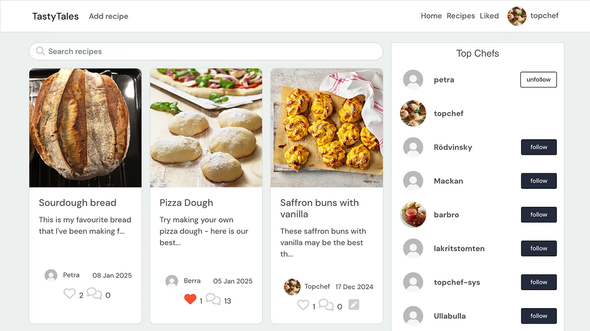
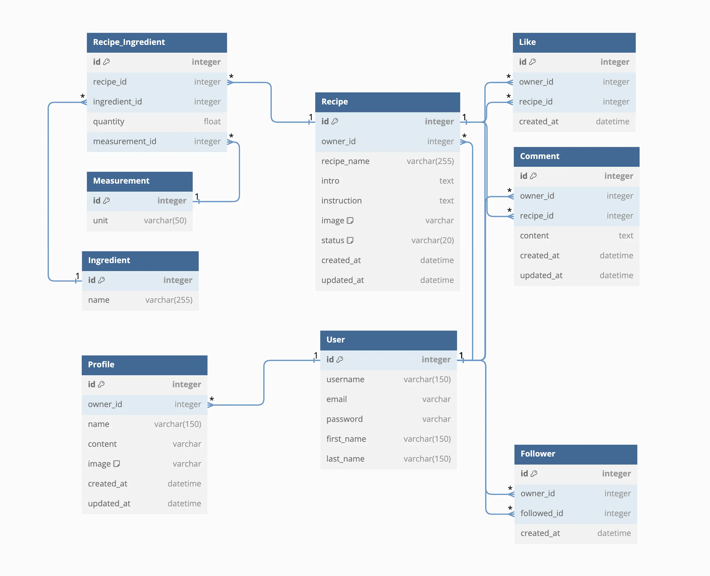

# tt-drf
# TastyTales - A Django Rest Framework API

TastyTales is a full-stack web application designed for sharing and managing recipes, and user interactions. It uses Django Rest Framework for the backend and provides functionality for users to explore recipes, interact with other users through comments and likes, and manage their profiles. The application incorporates user authentication and recipe management to deliver a seamless experience.


The TastyTales API serves as the backend service for the TastyTales application, enabling efficient data management and interaction.





## Table of Contents
- [TastyTales API](#tasty-tales-api)
  - [General Details](#general-details)
  - [Database and Models](#database-and-models)
  - [Technologies](#technologies)
  - [Testing and Issues](#testing-and-issues)
  - [Deployment](#deployment)
  - [Credits](#credits)

## General Details

This is the API for the TastyTales backend application. It manages user authentication, recipe management, and user interactions such as comments, likes, and followers.

- [Frontend repository](#https://github.com/behemot-biz/tastytales).
- [Live frontend site](#https://tastytales-83bed5f61a06.herokuapp.com).
- [Live API](#https://tastytales-api-56d55ea68c61.herokuapp.com).


## Database Design
### Database Model

The database for `TastyTales` is structured to be scalable and efficient, adhering to the DRY (Don't Repeat Yourself) principle. The **Recipe** table is central to this design, linking multiple models and efficiently storing recipe details, ingredients, and user interactions without duplication of data.

The initial design of the entity-relationship diagram (ERD) captures the core models of the system, including the relationships between recipes, ingredients, comments, likes, and followers. Every part of the model is carefully constructed to ensure maximum reuse and minimal redundancy.


### ERD

Below is a visual representation of the database model for the `TastyTales` project:
<details>
<summary>ERD, image of</summary>



</details>

### Custom Models

The database includes several custom models tailored specifically to the needs of `TastyTales`.

These models make use of foreign key relationships to keep the data model clean and flexible. For example, instead of duplicating ingredient data across multiple recipe entries, the `Recipe` and `Ingredient` models are connected via a many-to-many relationship through the `RecipeIngredient` model. This approach reduces redundancy and keeps the database optimized.

<details>
<summary>Custom Models</summary>

- **Profile**: Extends the user profile with additional details such as bio, image, and content.

- **Recipe**: Tracks user-created recipes, linking each entry to the user who created it. Recipes also include metadata such as images, instructions, and introduction text.

- **RecipeIngredient**: Connects recipes with ingredients, storing additional data such as quantity and measurement. It ensures efficient many-to-many relationships between recipes and ingredients.

- **Ingredient**: Manages ingredients for recipes, ensuring unique and reusable entries.

- **Measurement**: Defines units of measurement (e.g., grams, cups) for ingredient quantities.

- **Comment**: Enables users to add comments to recipes, fostering engagement and interaction among users.

- **Like**: Tracks likes on recipes, allowing users to express appreciation for shared content.

- **Follower**: Manages relationships between users, allowing one user to follow another and stay updated on their activities.


</details>


### CRUD Functionality

The CRUD (Create, Read, Update, Delete) principle is foundational to the design of the database and the entire application:

- **Create**: Authenticated users can create recipes, adding ingredients and descriptions. Users can also leave comments, likes, and follow other users.

- **Read**: Both users and admins can view recipes, their ingredient lists, user profiles, and interactions such as comments, likes, and followers.

- **Update**: Users can update their recipes, modifying recipe details, ingredients, and quantities as needed.

- **Delete**: Users can delete their recipes or comments if they are no longer relevant, and admins can remove inappropriate content.

## Database and Models

TastyTales uses SQLite for development and PostgreSQL for production, ensuring a scalable and reliable database for live deployment.

### User Model (from `django.contrib.auth.models.User`)

- **Table Name**: `auth_user`
- **Fields**: `id`, `username`, `email`, `password`, `first_name`, `last_name`, `is_staff`, `is_active`, `is_superuser`, `last_login`, `date_joined`
- **Functionality**: Manages user authentication and basic user details.

### Profile Model

- **Table Name**: `profile_profile`
- **Fields**: `id`, `owner`, `name`, `content`, `image`, `created_at`, `updated_at`
- **Functionality**: Extends the user profile with additional details such as bio and avatar.

### Recipe Model

- **Table Name**: `recipes_recipe`
- **Fields**: `id`, `owner`, `recipe_name`, `intro`, `instruction`, `image`, `created_at`, `updated_at`
- **Functionality**: Stores user-created recipes with descriptions and images.

### Ingredient Model

- **Table Name**: `recipes_ingredient`
- **Fields**: `id`, `name`
- **Functionality**: Manages ingredients for recipes.

### Measurement Model

- **Table Name**: `recipes_measurement`
- **Fields**: `id`, `measure`
- **Functionality**: Defines units for ingredient quantities (e.g., grams, liters).

### RecipeIngredient Model (Intermediate Table)

- **Table Name**: `recipes_recipeingredient`
- **Fields**: `id`, `recipe`, `ingredient`, `quantity`, `measure`
- **Functionality**: Manages many-to-many relationships between recipes and ingredients with additional data like quantity and measurement.

### Comment Model

- **Table Name**: `recipes_comment`
- **Fields**: `id`, `owner`, `recipe`, `content`, `created_at`, `updated_at`
- **Functionality**: Allows users to comment on recipes.

### Like Model

- **Table Name**: `recipes_like`
- **Fields**: `id`, `owner`, `recipe`, `created_at`
- **Functionality**: Enables users to like recipes.

### Follower Model

- **Table Name**: `followers_follower`
- **Fields**: `id`, `owner`, `followed`, `created_at`
- **Functionality**: Tracks user-to-user following relationships, ensuring unique and meaningful connections.


*<span style="color: blue;">[Back to top](#table-of-contents)</span>*

## Technologies


**Language:**
- [Python](https://www.python.org/)


**Web tools:**
- [GitHub](https://github.com) (repository)
- [Heroku platform](https://www.heroku.com/) (deployment platform)
- [CI Python Linter](https://pep8ci.herokuapp.com/#) (Python code validation)


**Frameworks and Libraries:**
- [Django](https://www.djangoproject.com/)
- [Django REST Framework](https://www.django-rest-framework.org/)
- [PostgreSQL](https://www.postgresql.org/)
- [Cloudinary](https://cloudinary.com/)
- [Dillinger](https://dillinger.io) (Readme editor)


### Libraries Used
The TastyTales application uses several external libraries. Below is a list of these libraries along with a breif description and instructions on how to install them.

### Python Libraries
<details>
<summary>List of libraries</summary>

- **asgiref**  
  - **Description**: ASGI is a standard for Python asynchronous web apps and servers to communicate.  
  - **Installation**: `pip install asgiref==3.8.1`  

- **certifi**  
  - **Description**: Mozilla’s curated collection of Root Certificates for SSL.  
  - **Installation**: `pip install certifi==2024.8.30`  

- **cffi**  
  - **Description**: Foreign Function Interface for Python calling C code.  
  - **Installation**: `pip install cffi==1.17.1`  

- **charset-normalizer**  
  - **Description**: Library for reading text from unknown charset encoding.  
  - **Installation**: `pip install charset-normalizer==3.4.0`  

- **cloudinary**  
  - **Description**: Integration with Cloudinary for managing images and files.  
  - **Installation**: `pip install cloudinary==1.41.0`  

- **coverage**  
  - **Description**: Code coverage measurement for Python.  
  - **Installation**: `pip install coverage==7.6.8`  

- **cryptography**  
  - **Description**: Provides cryptographic recipes and primitives to Python developers.  
  - **Installation**: `pip install cryptography==44.0.0`  

- **gunicorn**  
  - **Description**: Python WSGI HTTP Server for UNIX.  
  - **Installation**: `pip install gunicorn==23.0.0`  

- **idna**  
  - **Description**: Support for the Internationalized Domain Names in Applications protocol.  
  - **Installation**: `pip install idna==3.10`  

- **oauthlib**  
  - **Description**: Thorough implementation of the OAuth request-signing logic.  
  - **Installation**: `pip install oauthlib==3.2.2`  

- **packaging**  
  - **Description**: Core utilities for Python packages.  
  - **Installation**: `pip install packaging==24.2`  

- **Pillow**  
  - **Description**: Python Imaging Library for image processing.  
  - **Installation**: `pip install Pillow==8.2.0`  

- **psycopg2-binary**  
  - **Description**: PostgreSQL database adapter for Python.  
  - **Installation**: `pip install psycopg2-binary==2.9.10`  

- **PyJWT**  
  - **Description**: JSON Web Token implementation in Python.  
  - **Installation**: `pip install PyJWT==2.10.1`  

- **python3-openid**  
  - **Description**: OpenID support for modern servers and consumers.  
  - **Installation**: `pip install python3-openid==3.2.0`  

- **pytz**  
  - **Description**: Cross-platform timezone calculations.  
  - **Installation**: `pip install pytz==2024.2`  

- **requests**  
  - **Description**: Simple HTTP library for sending requests.  
  - **Installation**: `pip install requests==2.32.3`  

- **sqlparse**  
  - **Description**: Non-validating SQL parser for Python.  
  - **Installation**: `pip install sqlparse==0.5.2`  

- **typing_extensions**  
  - **Description**: Backported and experimental type hints.  
  - **Installation**: `pip install typing_extensions==4.12.2`  

- **urllib3**  
  - **Description**: HTTP library with thread-safe connection pooling.  
  - **Installation**: `pip install urllib3==2.2.3`  

</details>

### Django Libraries
<details>
<summary>List of libraries</summary>

- **Django**  
  - **Description**: High-level Python web framework.  
  - **Installation**: `pip install Django==4.2.16`  

- **django-allauth**  
  - **Description**: Integrated set of applications for authentication and account management.  
  - **Installation**: `pip install django-allauth==0.50.0`  

- **django-cloudinary-storage**  
  - **Description**: Facilitates integration with Cloudinary.  
  - **Installation**: `pip install django-cloudinary-storage==0.3.0`  

- **django-cors-headers**  
  - **Description**: Handles server headers for Cross-Origin Resource Sharing (CORS).  
  - **Installation**: `pip install django-cors-headers==4.6.0`  

- **django-filter**  
  - **Description**: Allows users to filter querysets dynamically.  
  - **Installation**: `pip install django-filter==24.3`  

- **djangorestframework**  
  - **Description**: Toolkit for building Web APIs.  
  - **Installation**: `pip install djangorestframework==3.15.2`  

- **djangorestframework-simplejwt**  
  - **Description**: Minimal JSON Web Token authentication plugin.  
  - **Installation**: `pip install djangorestframework-simplejwt==5.3.1`  

- **dj-database-url**  
  - **Description**: Utility for configuring the database using environment variables.  
  - **Installation**: `pip install dj-database-url==0.5.0`  

- **dj-rest-auth**  
  - **Description**: Set of API endpoints for User Registration and Authentication.  
  - **Installation**: `pip install dj-rest-auth==2.1.9`  

</details>

### External Libraries and Applications

<details>
<summary>List of libraries</summary>

- **Cloudinary**  
  - **Description**: Cloud-based image management and delivery solution.  
  - **Installation**: `pip install cloudinary==1.41.0`  

- **Coverage**  
  - **Description**: Code coverage measurement for Python.  
  - **Installation**: `pip install coverage==7.6.8`  

</details>

## Database

<details>
<summary>List of databases</summary>

- **PostgreSQL**: Used as the production database backend for scalability and robustness.  
- **SQLite**: Used as the development database backend for simplicity and ease of setup during the development process.

</details>

*<span style="color: blue;">[Back to top](#table-of-contents)</span>*

## Testing and Issues

Testing information and issues encountered during development are tracked and documented in the respective repositories.

## Deployment

<details>
<summary>Version Control</summary>

The following Git commands were used throughout development:
- `git add <file>`
- `git commit -m "commit message"`
- `git push`
</details>

<details>
<summary>Heroku Deployment</summary>


- Include `https://<your_app_name>.herokuapp.com` in the `ALLOWED_HOSTS` list.
- Set up environment variables for `DATABASE_URL`, `SECRET_KEY`, and `CLOUDINARY_URL`.
- Use a `Procfile` with:
  - `release: python manage.py makemigrations && python manage.py migrate`
  - `web: gunicorn tt_drf_api.wsgi`
</details>

<details>
<summary>GitHub Repository</summary>

- Clone the repository:
  ```bash
  git clone <repository_url>
  ```
- Create a virtual environment:
  ```bash
  python3 -m venv .venv
  source .venv/bin/activate
  ```
- Install dependencies:
  ```bash
  pip install -r requirements.txt
  ```
</details>

## Credits

<details>
<summary>Content</summary>


Resources that inspired and guided development:
- [Django Documentation](https://docs.djangoproject.com/)
- [Django REST Framework Docs](https://www.django-rest-framework.org/)
- [Code Institute Walkthrough Project](https://codeinstitute.net/)
</details>

<details>
<summary>Acknowledgements</summary>

Special thanks to all contributors and resources used in the development of TastyTales API.
</details>


*<span style="color: blue;">[Back to top](#table-of-contents)</span>*